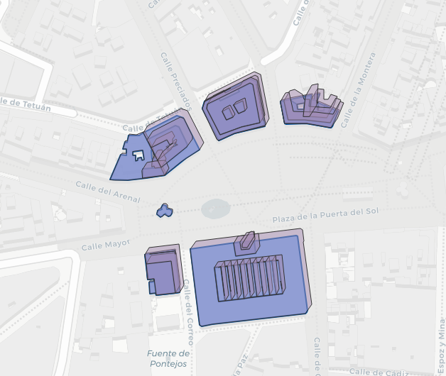
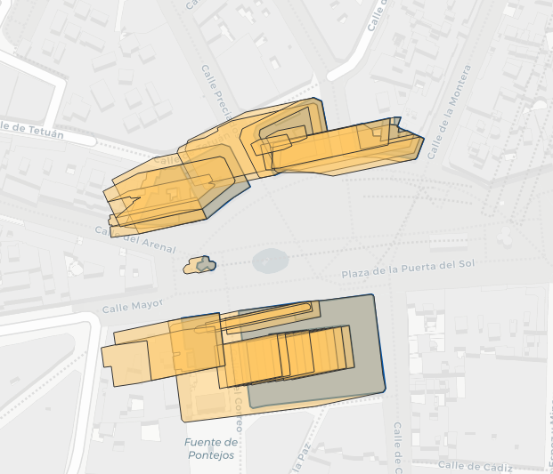
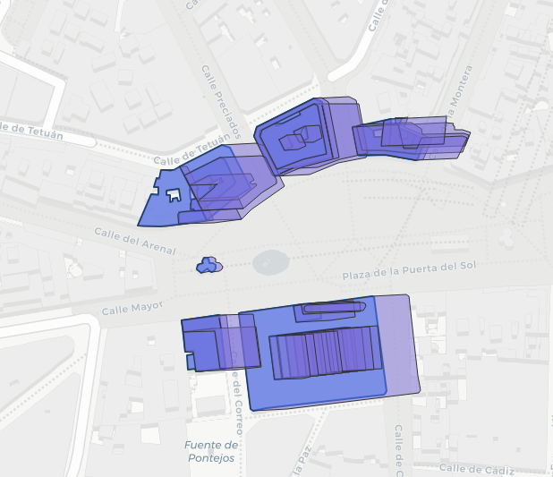

# Building Shadow

Visualize how buildings cast shadows throughout the day using real building data and sun position calculations.



## Features

- **Multiple data sources**: OpenStreetMap (worldwide), Overture Maps (ML-generated), Spanish Cadastre (Spain)
- Compute shadows based on sun position for any date/time
- Support for seasonal sun trajectories (spring, summer, autumn, winter)
- Interactive HTML visualization with layer controls
- Automatic height extraction from source data

## Installation

```bash
# Using mise and uv (recommended)
mise trust && mise install
uv sync

# Optional: Install DuckDB for Overture Maps support
uv add duckdb

# Or with pip
pip install -e .
```

## Quick Start

```bash
# Using an address (OpenStreetMap - default)
building-shadow visualize --address "Plaza Mayor, Madrid, Spain"

# Using coordinates with Overture Maps
building-shadow visualize --lat 40.4168 --lon -3.7038 --source overture

# Using Spanish Cadastre for Spain
building-shadow visualize -a "Puerta del Sol, Madrid" --source catastro

# Check available data sources
building-shadow sources
```

Open the generated `building_shadows.html` in a browser to see the interactive map.

## Example Output

The visualization shows buildings (blue) and their shadows at different times of day:

| Morning (9:00) | Midday (12:00) | Evening (18:00) |
|----------------|----------------|-----------------|
|  |  |  |

*Shadows in Puerta del Sol, Madrid (50m radius, summer)*

## Data Sources

| Source | Coverage | Command |
|--------|----------|---------|
| OpenStreetMap | Worldwide | `--source osm` (default) |
| Overture Maps | Worldwide | `--source overture` |
| Spanish Cadastre | Spain only | `--source catastro` |

```bash
# List available sources on your system
building-shadow sources
```

## Options

| Option | Short | Description | Default |
|--------|-------|-------------|---------|
| `--address` | `-a` | Street address to geocode | - |
| `--latitude` | `--lat` | Latitude coordinate | - |
| `--longitude` | `--lon` | Longitude coordinate | - |
| `--radius` | `-r` | Search radius in meters | 300 |
| `--source` | `-src` | Data source (osm/overture/catastro) | osm |
| `--season` | `-s` | Season (spring/summer/autumn/winter) | summer |
| `--start-hour` | - | Start hour (0-23) | 9 |
| `--end-hour` | - | End hour (0-23) | 21 |
| `--timezone` | `-tz` | Local timezone | Europe/Madrid |
| `--default-height` | - | Default building height (m) | 15 |
| `--output` | `-o` | Output HTML file | building_shadows.html |

## Documentation

See the [docs/](docs/) folder for detailed documentation:

- [Getting Started](docs/getting-started.md) - Installation and quick start
- [Data Sources](docs/data-sources.md) - How building data is obtained
- [Shadow Computation](docs/shadow-computation.md) - How shadows are calculated
- [Visualization](docs/visualization.md) - Understanding the output
- [CLI Reference](docs/cli-reference.md) - Complete command-line reference

## How it works

1. **Geocoding**: Converts address to coordinates (using Nominatim)
2. **Building fetch**: Retrieves building footprints from selected data source
3. **Shadow computation**: Calculates sun position and projects shadows using pybdshadow
4. **Visualization**: Generates interactive Folium map with layer controls

## Technology Stack

| Component | Library | Purpose |
|-----------|---------|---------|
| OSM data | [OSMnx](https://osmnx.readthedocs.io/) | Fetch OpenStreetMap features |
| Overture data | [DuckDB](https://duckdb.org/) | Query Overture Maps GeoParquet |
| Catastro data | [GeoPandas](https://geopandas.org/) | Query Spanish Cadastre WFS |
| Shadow computation | [pybdshadow](https://github.com/ni1o1/pybdshadow) | Sun position and shadow geometry |
| Visualization | [Folium](https://python-visualization.github.io/folium/) | Interactive web maps |
| Geocoding | [GeoPy](https://geopy.readthedocs.io/) | Address to coordinates |
| CLI | [Typer](https://typer.tiangolo.com/) | Command-line interface |

## Development

```bash
# Install dev dependencies
uv sync --all-groups

# Install pre-commit hooks
uv run pre-commit install

# Run linting
uv run ruff check src/

# Run type checking
uv run mypy src/

# Run all pre-commit hooks
uv run pre-commit run --all-files
```

## License

MIT
